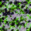
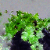
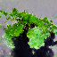

# Flow Matching for Graphs

## Description
Simple experiment on flow matching for graphs.  
The goal is to generate images from a Stable Diffusion dataset using graph convolution.

## Method
Images are represented as graph signals on a grid graph.  
Node spatial information is injected via concatenation at the start of training.

Tested positional encodings:
- Laplacian eigenvectors
- Raw indexing
- Fourier frequencies

We evaluate the differences by overfitting on a single sample.  
Results are stored in the `outputs` folder.

## Preliminary results
Injecting node localization clearly improves the results (compare *None* vs Laplacian / Fourier).  
Fourier features perform best visually, but are less generalizable than Laplacian-based methods.

### Comparison

  
  
  
  
  

  <b>GT</b> &nbsp; | &nbsp;
  <b>None</b> &nbsp; | &nbsp;
  <b>Indexing</b> &nbsp; | &nbsp;
  <b>Laplacian</b> &nbsp; | &nbsp;
  <b>Fourier</b>

Recall: This is an overfitting !

## TODO
- Try Graph Attention  
- Add text conditioning (e.g. UMT5) to generate pixels on a random mesh  
