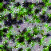
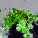
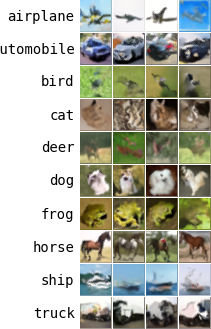
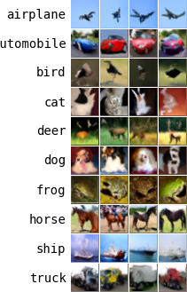

# Flow Matching for Graphs

## Overview

Research project on **flow matching for graph-structured image generation**.  
Images are treated as signals on graphs (grid or Delaunay mesh); the model learns a rectified-flow
velocity field transporting noise to pixel colors.

Two lines of experiments:
1. **Positional encoding ablation** — overfit a single image, compare PE strategies on a grid graph.
2. **PGNN on CIFAR-10** — class-conditional generation at scale with a hierarchical GNN + DiT architecture.

---

## 1 · Positional Encoding Ablation

Images are represented as graph signals on a fixed grid graph.  
Spatial information is injected by concatenating a positional encoding to each node's input features.
The model is a mixed of GraphConv and MLP per nodes.

Tested encodings:
- **None** — no position signal
- **Indexing** — raw node index
- **Laplacian** — first k eigenvectors of the normalized graph Laplacian
- **Fourier** — sinusoidal features at 2^k frequencies

Evaluation: overfit on a single image and compare reconstruction quality.

<p align="center">
  
  
  
  
  
</p>

<p align="center">
  <b>GT</b> &nbsp;|&nbsp;
  <b>None</b> &nbsp;|&nbsp;
  <b>Indexing</b> &nbsp;|&nbsp;
  <b>Laplacian</b> &nbsp;|&nbsp;
  <b>Fourier</b>
</p>

Injecting node localization clearly improves reconstruction.  
Fourier features perform best visually; Laplacian eigenvectors are more principled
(permutation-equivariant, topology-aware) and generalize better to unseen graph topologies.

---

## 2 · PGNN: Hierarchical GNN + DiT for CIFAR-10

> **Current scope:** nodes are equipped with raw Cartesian (x, y) coordinates and experiments
> run on a fixed **grid mesh**. Regarding the previous ablation we used in a first time fourier cartesian encoding
> Future work will move to **Delaunay meshes** built from
> sampled point clouds, enabling generation on arbitrary topologies.

### Architecture

`PGNN` (Partitioned Graph Neural Network) couples local graph convolutions with global transformer
attention through a METIS-based coarsening step.  
The graph is partitioned into balanced patches with **METIS** before training, making full
self-attention tractable at high node counts (quadratic cost is paid on patches, not the whole graph).

```
Input (noisy RGB + Cartesian PE)
        │
  ┌─────▼──────┐
  │  SAGEConv  │  ×n   encoder stem — expanding channel pyramid
  │  + adaLN-t │        time-conditioned LayerNorm (zero-init)
  └─────┬──────┘
        │
  Learned pooling  →  metanodes  (one per METIS patch)
        │
  ┌─────▼──────────────────────┐
  │  DiT self-attention block  │  ×n   time + class adaLN-zero
  │  on (B, n_patches, d_model)│
  └─────┬──────────────────────┘
        │
  adaLN-zero  ──►  fine nodes  (global context → local convolutions)
        │
  ┌─────▼──────┐
  │  SAGEConv  │  ×n   decoder head — contracting pyramid → 3 channels
  └─────┬──────┘
        │
   Velocity field  (N_nodes, 3)
```

**Key design points:**
- **METIS partitioning** — balanced graph cuts keep patch sizes uniform; attention scales to
  thousands of nodes without quadratic blowup on the full graph.
- **Bidirectional fine ↔ coarse** — fine nodes are pooled into metanodes for global attention,
  then metanode features modulate fine-level LayerNorm via adaLN-zero.
- **CFG training** — class token 10 is the unconditional slot; 10 % dropout during training
  enables classifier-free guidance at inference.

### Training — CIFAR-10
Training done on RTX 4090 during 12 hours.

| Setting | Value |
|---|---|
| Dataset | CIFAR-10, 32 × 32 RGB, 10 classes |
| Graph | Fixed grid (1 024 nodes) |
| Model | PGNN — hidden 128 / sdim 512 / 4 DiT blocks / 8 heads |
| EMA | decay = 0.9999 |
| Sampler | Euler, 10–20 steps, CFG ∈ {1, 3, 5} |

### Results

**FID(2048) ≈ 60** on all 10 classes after 60 k gradient steps (single GPU, compute-limited).  
Generated images are class-recognizable at this scale. 

Notice that the model still has reasonable size: 20M params.

<p align="center">
  
  
</p>

<p align="center">
  <b>CFG = 3</b> &nbsp;|&nbsp; <b>CFG = 5</b>
</p>

Higher CFG sharpens class features at the cost of sample diversity — a standard fidelity/diversity
trade-off consistent with the flow matching framework.

---

## TODO

- Full FID sweep (feature = 2048, all classes, n = 5 000) after longer training
- Text conditioning via T5 (replace class embedding with cross-attention on text tokens)
- Extend to arbitrary topology (Delaunay mesh instead of fixed grid)
- Scale model size and compare against pixel-space baselines (DDPM, DiT-S/2)
