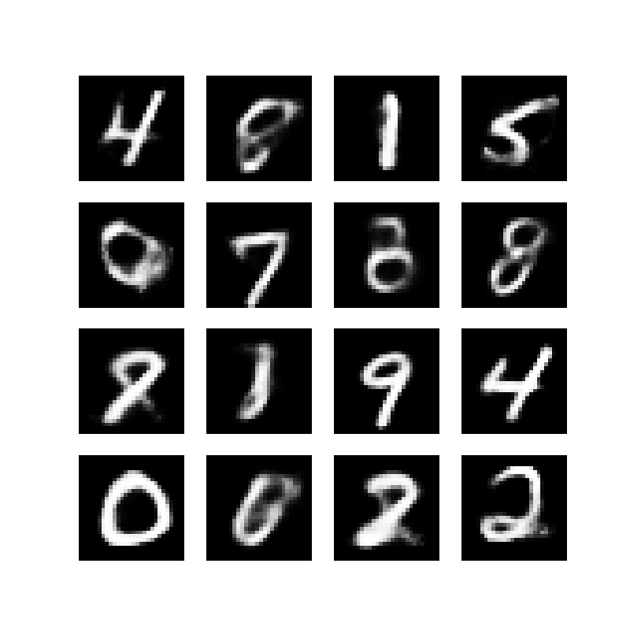
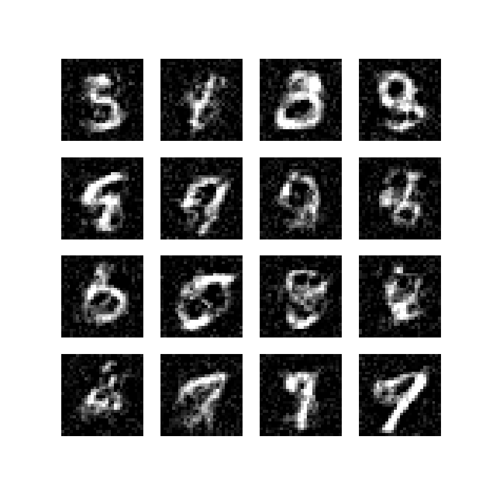

# Flow Matching on MNIST

## Description
This repo implements flow matching models to generate MNIST images.

Two approaches are explored:
- Using a VAE (from the `vae` folder)
- Direct generation in pixel space

Both models have comparable architectures and number of parameters, and are not conditioned on the digit.

## Results
- Visually, the VAE-based approach performs significantly better than direct pixel-space generation

### Comparison

  
  

  <b>Left:</b> Latent space (VAE) &nbsp;&nbsp;&nbsp; | &nbsp;&nbsp;&nbsp; <b>Right:</b> Pixel space

The samples are generated using main.py (for pixel space version) and main_latent.py (for the VAE based version).

## TODO
- Compare models using FID scores.
- Try to vary the beta coefficient of the VAE.
- Add a digit condition.
