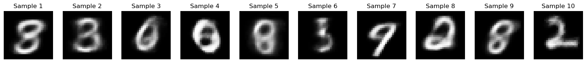
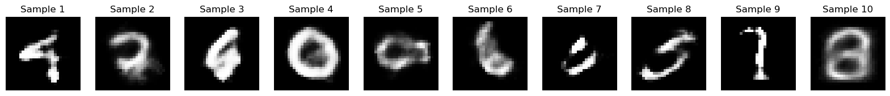

# VAE vs SigReg VAE

## Description
This project compares a standard VAE (`vae.py`) with a VAE trained using a SigReg loss (`vae_sigloss.py`).

## Method
- One reconstructed sample is saved per epoch  
- Results are stored in two separate folders  
- Evaluation is done visually  

## Results

  <b>Classic VAE</b> 
  

  <b>SigReg VAE</b> 
  

> ⚠️ Comparison should be interpreted carefully:  
> the KL coefficient (β) and the SigReg coefficient (λ) are not directly comparable.

## TODO
- Add FID metric on generated samples  
- Clarify and analyze reconstruction loss  
- Combine FID + reconstruction analysis  
